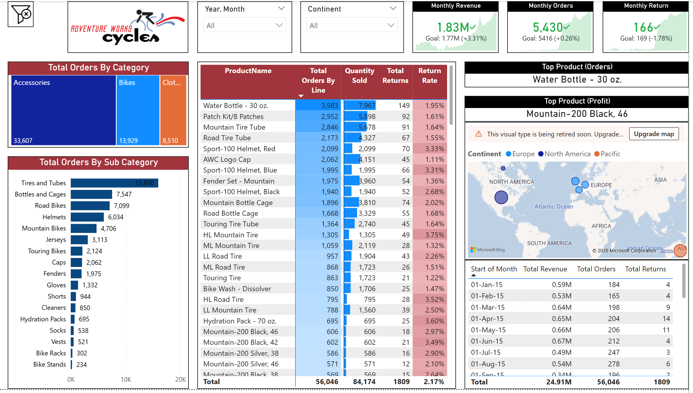
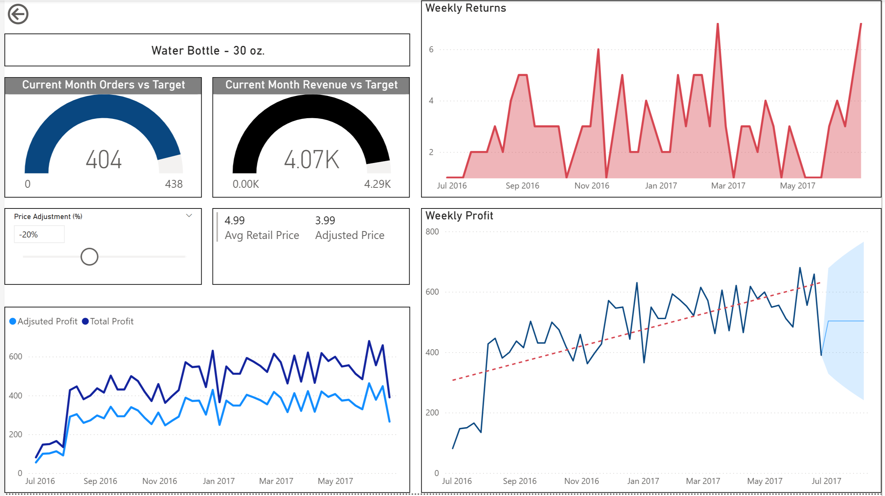
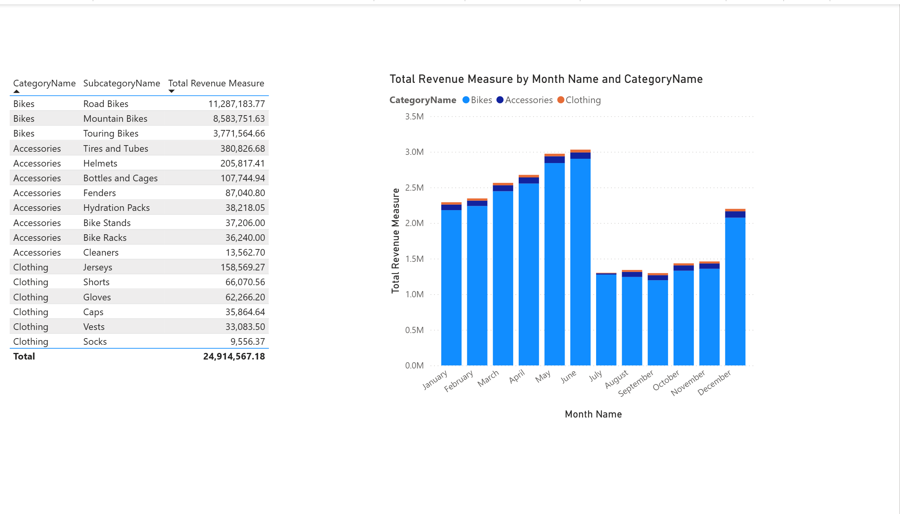

# Adventure Works Sales Performance Dashboard

## Introduction

Data analysis is crucial to improve a company's sales performance which can inturn grow said company. This dashboard is designed specifically to monitor the bike sales for **Adventure world cycles** Using a real-world dataset with details on product categories, orders, and locations—this project offers a streamlined, multi-page interface to quickly explore crucial market trends and sales insights.

### Dashboard File
You can find the file for the dashboard here: [`AdventureWorks_Dashboard.pbix`](AdventureWorks_Report.pbix).  

## Skills Showcased

This project put key Power BI features into practice. Here's what IS mastered:

* **🎨 Dashboard Design:** Crafting an intuitive and visually appealing report layout.
* **⚙️ Power Query ETL:** Performing data cleaning, shaping, and transformation.
* **🔗 Data Modeling:** Building efficient data models with relationships (Star Schema principles).
* **🧮 DAX Fundamentals:** Creating calculations and aggregations to derive key insights.
* **📊 Visualizations Utilized:**
    * **📈 Core Charts:** Column, Bar, Line, and Area charts for comparisons and trends.
    * **🗺️ Map Charts:** For displaying geospatial data.
    * **🔢 Cards:** To highlight key performance indicators.
    * **📋 Tables:** For presenting detailed, tabular information.
    * **🎨 Chart Variety:** Selecting from common and uncommon chart types for effective storytelling.

---

## Dashboard Overview

 

This page gives an overview on the most important statistics and metrics such as **KPIs, the most ordered product categories, which country has the most orders, and monthly revenue**.
  
  
  
 

This page goes into detail about the **company profits, revenue, and returns**.

  
  
  
 

This page focuses on **bike sales data** to find out the **type, total orders, and total revenue** for each type of bike.

  
  
  
 

This page showcases the **total revenue generated by each product category** in each month. It provides an intuitive, easy-to-read column chart to find out **what products generate the most revenue and during which months**.

----

